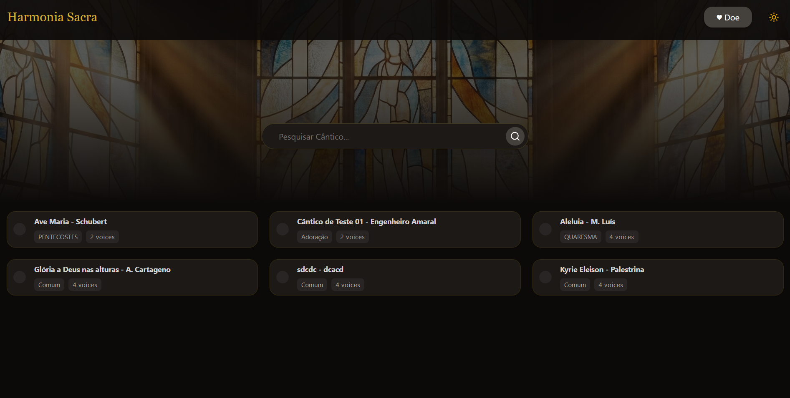
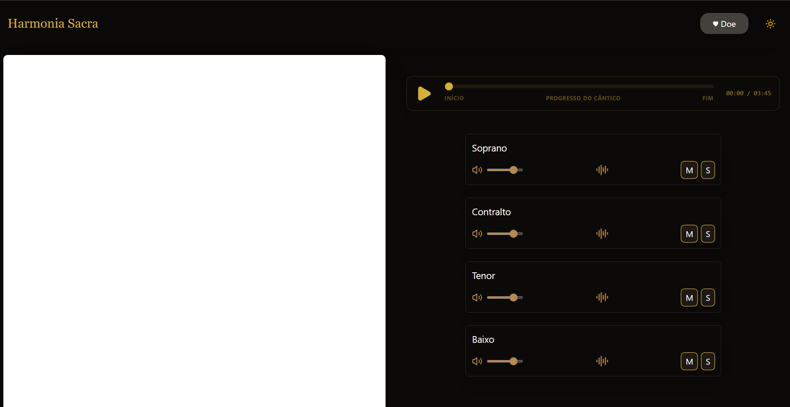

# Harmonia Sacra 🎵
 
> The largest library of sacred chants in the Portuguese language — with sheet music and per-voice audio tracks for amateur choir singers.
 
---
 
## The Problem
 
Most amateur singers in church choirs **cannot read sheet music**. Learning a new voice part is hard without an audio reference: rehearsals are short, conductors have little individual time for each singer, and there is no centralised platform with resources in Portuguese.
 
**Harmonia Sacra** solves this. Every chant includes its sheet music and separate audio tracks per voice (Soprano, Alto, Tenor, Bass) — so each singer can study their part independently, at their own pace.
 
---
 
## Features
 
- 🔍 **Chant search** by title or category (Lent, Pentecost, Worship, Common...)
- 🎼 **Integrated sheet music viewer**
- 🎧 **Multi-track audio player** with individual volume control per voice (Soprano, Alto, Tenor, Bass)
- 🔇 **Mute / Solo** per track — isolate or silence individual voice parts
- 🌙 **Dark mode and light mode** with a consistent visual identity
- 🛠️ **Admin panel** for managing and uploading chants
### Coming soon
- Advanced search by composer, liturgical season, and key
- Personal bookmarks and notes per chant
- Practice mode with section loop
- Native mobile app
---
 
## Screenshots
 
### Dark Mode — Chant Library

 
### Voice Player

 
---
 
## Tech Stack
 
| Technology | Purpose |
|---|---|
| React 19 + TypeScript | UI and component logic |
| Vite | Build tooling and dev server |
| Tailwind CSS v4 | Styling and design system |
| React Router v7 | Client-side navigation |
| Firebase (Firestore + Storage) | Database and audio/sheet music storage |
| Framer Motion | UI animations |
| Lucide React | Icons |
 
---
 
## Design
 
The project has a custom visual identity built from scratch:
 
- **Color palette:** golden tones (`#C9A84C`) on dark backgrounds, inspired by the aesthetic of sacred manuscripts and medieval illuminations
- **Typography:** clean and legible, optimised for reading sheet music and use on mobile devices
- **Dual theme:** dark mode (default) and light mode, with smooth transitions
- **Reusable components:** modular component architecture with clear separation between UI, logic, and types
---
 
## Project Structure
 
```
src/
├── components/
│   ├── admin/          # Admin dashboard and forms
│   │   ├── AdminDashboard.tsx
│   │   ├── AdminSongRow.tsx
│   │   └── SongForm.tsx
│   ├── Header.tsx
│   ├── Home.tsx
│   ├── Layout.tsx
│   ├── SearchBar.tsx
│   ├── SongCard.tsx
│   ├── SongDetail.tsx
│   ├── ThemeToggle.tsx
│   └── TrackControl.tsx
├── lib/
│   └── firebase.ts     # Firebase configuration
├── types/
│   ├── song.ts         # Domain TypeScript types
│   └── form.ts
└── App.tsx
```
 
---
 
## Vision
 
The long-term goal is for Harmonia Sacra to become the **largest library of sacred chants in the Portuguese language**, featuring:
 
- Hundreds of catalogued chants with sheet music and per-voice audio
- A community of choirs contributing their repertoire
---
 
## About
 
Built by **Josevany Amaral** — Mobile Development student at ISTEC Lisboa, with a background in classical singing and experience in church choirs. This project was born from a real need identified in the Portuguese choral community.
 
---
 
> *"A música sacra não é só para quem sabe ler partitura."*
